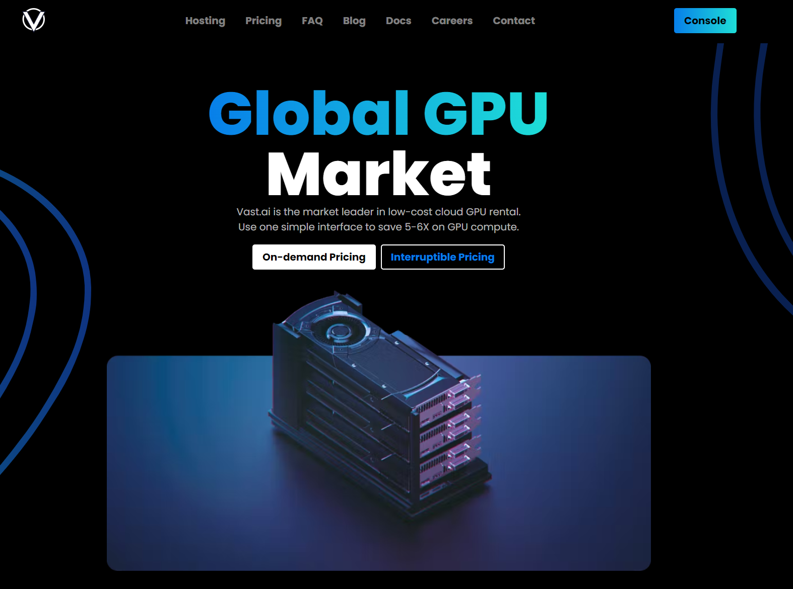
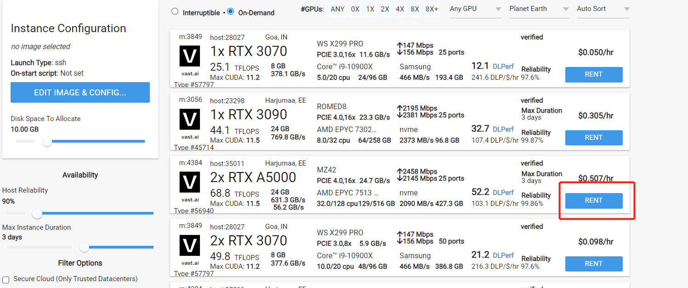
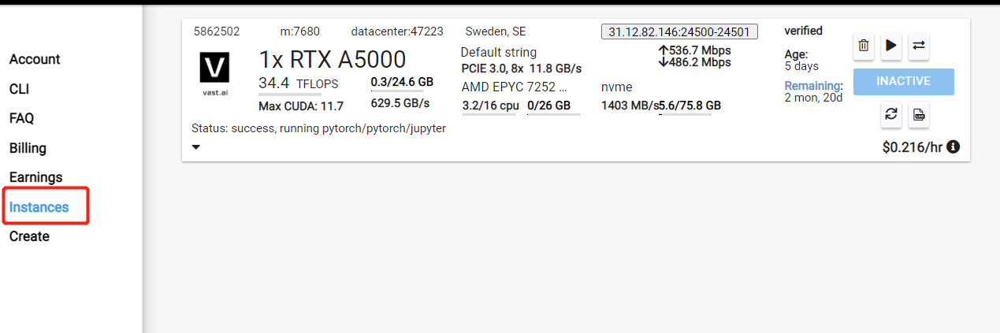

# GPU Server Usage
This page gives brief instruction on how we use remote computation resources when colab is not enough.

## Vast.ai
[Vast.ai](https://vast.ai/) is a popular gpu renting platform which provides capable gpu servers. The usage is very straghtforward and it provides detailed documentation. 

### Usage 
1. log into the console 
2. Select instance and rent 

3. To run the code in Jupyter terminal, start the terminal from Instances page

4. To use big datasets and large models in vastai, we can upload them first to the google drive and download them from vastai commandlines, as compared to local uploading, downloading from gdrive is much faster.
5. For more detailed use, check their [documents](https://vast.ai/docs/overview/basics)